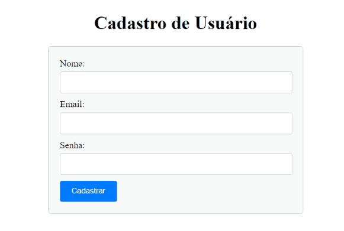

# AULA PRÁTICA - DISCIPLINA: Portfólio_Programação para Internet em Back-end

Instituição de Ensino: Faculdade Anhaguera

Linguagens utilizadas: PHP, HTML, CSS, SQL e MySQL

IDE sugerida pelo docente: VSCode e PHP, além do XAMPP.

## Atividade proposta:
Compreender e implementar uma aplicação simples de cadastro de usuário utilizando tecnologia de banco de dados Mysql com PHPMyadmin, com validação de campo e para armazenamento das informações no banco de dados, a utilização da linguagem PHP.

## Checklist: 
- Instalação das ferramentas necessárias para programação. Neste caso, o XAMPP e VSCode; 
- Criação do projeto e sua estrutura de diretórios dentro da pasta C:/xampp/htdocs/cadastro-simplificado; 
- Criação dos arquivos: index.php, conexao.php, cadastrar.php, css/formulario.css; 
- Criação da base de dados DBCadUser e da tabela usuario; 
- Programação da página de formulário de cadastro, contendo 3 campos: nome, email e senha; 
- Construção do código da página index.php, ou seja, formulário contendo 3 campos (mencionados no tópico anterior) e um botão “Cadastrar”.

## Pré-requisitos

- [XAMPP](https://www.apachefriends.org/index.html) instalado
- Conexão à Internet (para carregar os scripts do Bootstrap)

## Como Usar

1. Clone este repositório para o seu computador
2. Inicie o Apache e o MySQL no XAMPP
3. Abra seu navegador e acesse http://localhost/cadastro-simplificado
4. Preencha o formulário de cadastro e clique em "Cadastrar"
5. Verifique se os dados são inseridos corretamente no banco de dados.

## Definição dos objetivos da aula prática:
Esse projeto deve ser criado diretamente na pasta htdocs, que está presente dentro do diretório principal do Xampp. 
Em seguida abra o projeto no VSCode.
O nome da pasta do projeto será cadastro-simplificado.

O primeiro arquivo, formulario.css, vai conter os codigos de estilo do projeto. 
O arquivo index.php, será o formulário propriamente dito, o nome do arquivo é index para facilitar o acesso à aplicação pelo navegador, quando hospedado localmente no servidor fornecido pela ferramenta Xampp. 

Faça a validação do campo de e-mail no formulário. 
Essa validação consiste em verificar se o que está sendo digitado é de fato um e-mail ou não. 
O arquivo conexao.php é o responsável por realizar a conexão com o banco de dados. 
É nele que poderá ser utilizada, por exemplo, o método de conexão do php, o mysqli_connect(). 
Nesse arquivo, você pode utilizar uma estrutura de decisão com if para verificar se a conexão foi bem sucedida. 
Caso tenha tido algum problema durante o processo de conexão, você pode usar a função mysqli_connect_error() que serve para retornar uma string contendo o último erro em sua chamada.
O arquivo cadastrar.php é onde será feita a chamada SQL responsável pela inserção dos dados do formulário de cadastro na base de dados. 
Para isso, você poderá utilizar a função mysqli_query() que é a responsável pela execução de uma chamada SQL através do PHP. 
Neste arquivo você deverá assegurar que a senha digitada seja salva no banco de dados de maneira encripitada. 
Caso algum erro seja encontrado, você poderá utilizar a função mysqli_error(), responsável por retornar uma string com o erro encontrado.

Note que estamos falando de funções do PHP que podem ser utilizadas na forma de programação procedural. 
Poderia usar o PDO do PHP para conexão, já que este é baseado em orientação a objetos. 
No entanto, para compreender o processo de conexão a banco de dados, sugere-se utilizar o formato procedural para que a compreensão seja facilitada.

## Resultados da aula prática: 
Construção de um pequeno projeto de formulário de cadastro contendo três campos sendo: nome, e-mail e senha.
A página deverá ser escrita em PHP para garantir a gravação dos dados em banco de dados e a página principal, aquela que será o formulário de cadastro, deverá ser estilizada com CSS. 
O projeto deverá conter no total 5 arquivos, sendo 3 de PHP, 1 de CSS e um script de SQL da base de dados construída. 
Esta pode ser feita com auxílio do PHPMyadmin.
